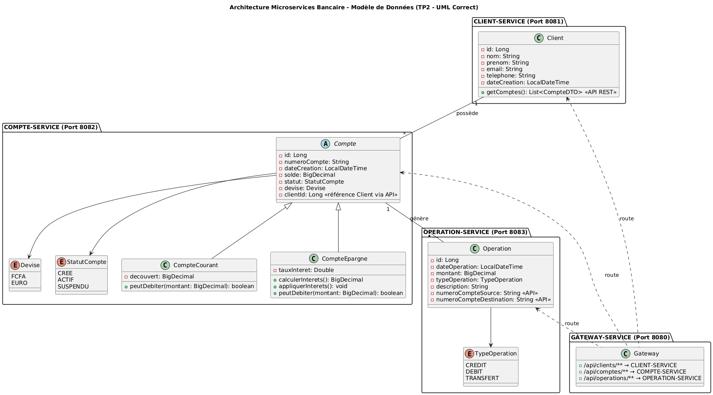
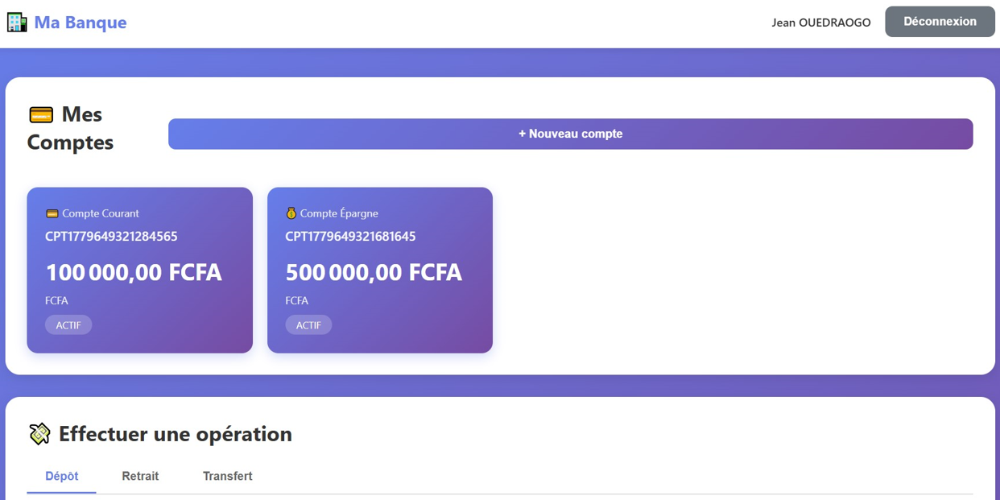

# 🏦 Application Bancaire Microservices - Guide Complet

## 📋 Vue d'ensemble du projet

Application bancaire complète en architecture microservices avec interface web.

### Architecture

```
┌─────────────────────────────────────────────────────────────┐
│                    Frontend (HTML/CSS/JS)                    │
│                     http://localhost:3000                     │
└───────────────────────────┬─────────────────────────────────┘
                            │
                            ↓
┌─────────────────────────────────────────────────────────────┐
│              Gateway Service (Port 8080)                     │
│                   API Gateway + Routing                      │
└────────┬────────────────────┬─────────────────┬─────────────┘
         │                    │                 │
         ↓                    ↓                 ↓
┌────────────────┐   ┌────────────────┐   ┌──────────────────┐
│ Client Service │   │ Compte Service │   │ Operation Service│
│   Port 8081    │   │   Port 8082    │   │   Port 8083      │
│   (H2 DB)      │   │   (H2 DB)      │   │   (H2 DB)        │
└────────────────┘   └────────────────┘   └──────────────────┘
         │                    │                     │
         └────────────────────┴─────────────────────┘
                            │
                            ↓
                ┌───────────────────────┐
                │  Eureka Server (8761) │
                │   Service Discovery   │
                └───────────────────────┘
```

## 🚀 Démarrage Rapide

### Étape 1 : Démarrer les microservices

**Ordre de démarrage (IMPORTANT) :**

```bash
# Terminal 1 - Eureka Server (démarrer en premier)
cd eureka-server
./mvnw spring-boot:run

# Attendre que Eureka soit complètement démarré (environ 30 secondes)
# Vérifier sur http://localhost:8761

# Terminal 2 - Client Service
cd client-service
./mvnw spring-boot:run

# Terminal 3 - Compte Service
cd compte-service
./mvnw spring-boot:run

# Terminal 4 - Operation Service
cd operation-service
./mvnw spring-boot:run

# Terminal 5 - Gateway Service (démarrer en dernier)
cd gateway-service
./mvnw spring-boot:run
```

### Étape 2 : Démarrer le Frontend

```bash
# Terminal 6 - Frontend
cd frontend-banking

# Option 1 : Avec Python
python -m http.server 3000

# Option 2 : Avec Node.js
npx http-server -p 3000

# Option 3 : Ouvrir directement index.html dans le navigateur
```

### Étape 3 : Accéder à l'application

- **Frontend** : http://localhost:3000
- **Gateway** : http://localhost:8080
- **Eureka** : http://localhost:8761

## 📱 Utilisation de l'application

### 1️⃣ Créer un compte client

1. Ouvrir http://localhost:3000
2. Cliquer sur "Inscrivez-vous"
3. Remplir le formulaire :
   - Nom : Dupont
   - Prénom : Jean
   - Email : jean.dupont@email.com
   - Téléphone : 0612345678
   - Code PIN : 1234
4. **Noter l'ID client** qui s'affiche (ex: "Votre ID est : 1")

### 2️⃣ Se connecter

1. Revenir à la page de connexion
2. Entrer l'ID client (ex: 1)
3. Entrer le code PIN (1234)
4. Cliquer sur "Se connecter"

### 3️⃣ Créer un compte bancaire

1. Sur le dashboard, cliquer sur "+ Nouveau compte"
2. Choisir "Compte Courant"
3. Découvert : 500
4. Devise : EUR
5. Valider

### 4️⃣ Effectuer des opérations

**Dépôt :**
- Onglet "Dépôt"
- Sélectionner le compte
- Montant : 1000
- Description : Salaire
- Valider

**Retrait :**
- Onglet "Retrait"
- Sélectionner le compte
- Montant : 200
- Description : Courses
- Valider

**Transfert :**
- Créer un 2ème compte d'abord
- Onglet "Transfert"
- Compte source : premier compte
- Compte dest : numéro du 2ème compte (format CPT...)
- Montant : 100
- Valider

### 5️⃣ Consulter l'historique

- Descendre sur la page
- Sélectionner un compte ou "Tous les comptes"
- Voir toutes les opérations effectuées

## 🔧 Vérifications et Tests

### Vérifier que tous les services sont enregistrés

Ouvrir http://localhost:8761 et vérifier que vous voyez :
- CLIENT-SERVICE
- COMPTE-SERVICE
- OPERATION-SERVICE
- GATEWAY-SERVICE

### Tester les endpoints manuellement

```bash
# Créer un client
curl -X POST http://localhost:8080/api/clients/register \
  -H "Content-Type: application/json" \
  -d '{
    "nom": "Test",
    "prenom": "User",
    "email": "test@email.com",
    "telephone": "0612345678",
    "codePin": "1234"
  }'

# Valider le PIN (connexion)
curl -X POST http://localhost:8080/api/clients/validate-pin \
  -H "Content-Type: application/json" \
  -d '{"clientId": 1, "codePin": "1234"}'

# Créer un compte courant
curl -X POST http://localhost:8080/api/comptes/courant \
  -H "Content-Type: application/json" \
  -d '{
    "clientId": 1,
    "decouvert": 500,
    "devise": "EUR"
  }'

# Lister les comptes d'un client
curl http://localhost:8080/api/comptes/client/1

# Effectuer un dépôt
curl -X POST http://localhost:8080/api/operations/credit \
  -H "Content-Type: application/json" \
  -d '{
    "numeroCompte": "CPT...",
    "montant": 1000,
    "description": "Dépôt initial"
  }'
```

## 🗄️ Accès aux bases de données H2

Chaque microservice a sa propre console H2 :

- **Client Service** : http://localhost:8081/h2-console
  - JDBC URL : `jdbc:h2:mem:clientdb`
  - Username : `sa`
  - Password : (vide)

- **Compte Service** : http://localhost:8082/h2-console
  - JDBC URL : `jdbc:h2:mem:comptedb`
  - Username : `sa`
  - Password : (vide)

- **Operation Service** : http://localhost:8083/h2-console
  - JDBC URL : `jdbc:h2:mem:operationdb`
  - Username : `sa`
  - Password : (vide)

## 🐛 Résolution des problèmes

### Problème : Les services ne se connectent pas à Eureka

**Solution :**
1. Vérifier qu'Eureka est démarré en premier
2. Attendre 30 secondes après le démarrage d'Eureka
3. Redémarrer les services métier

### Problème : Erreur CORS dans le frontend

**Solution :**
1. Vérifier que le fichier `CorsConfig.java` existe dans gateway-service
2. Redémarrer la Gateway
3. Vider le cache du navigateur (Ctrl+Shift+R)

### Problème : "Client non trouvé" lors de la connexion

**Solution :**
1. Vérifier que le client-service est bien démarré
2. Vérifier l'ID client (il commence à 1)
3. Consulter la base H2 pour voir les clients créés

### Problème : Erreur "Port already in use"

**Solution :**
```bash
# Linux/Mac
lsof -ti:8080 | xargs kill -9

# Windows
netstat -ano | findstr :8080
taskkill /PID <PID> /F
```

### Problème : Les comptes ne s'affichent pas

**Solution :**
1. Ouvrir la console du navigateur (F12)
2. Vérifier les erreurs réseau
3. S'assurer que le compte-service répond sur le port 8082
4. Vérifier la console Eureka pour voir si le service est enregistré

## 📊 Données de test

### Créer rapidement des données de test

```sql
-- Dans client-service H2 console
INSERT INTO CLIENT (id, nom, prenom, email, telephone, code_pin, date_creation) 
VALUES (1, 'Dupont', 'Jean', 'jean.dupont@email.com', '0612345678', '1234', CURRENT_TIMESTAMP);

INSERT INTO CLIENT (id, nom, prenom, email, telephone, code_pin, date_creation) 
VALUES (2, 'Martin', 'Marie', 'marie.martin@email.com', '0687654321', '5678', CURRENT_TIMESTAMP);
```

## 🏗️ Structure du projet

```
banking-microservice/
├── client-service/          # Gestion des clients
├── compte-service/          # Gestion des comptes
├── operation-service/       # Gestion des opérations
├── eureka-server/          # Service discovery
├── gateway-service/        # API Gateway
└── frontend-banking/       # Interface web
    ├── index.html
    ├── styles.css
    ├── app.js
    └── README.md
    

```
,

## 🔐 Comptes de test

Après le premier démarrage, les données suivantes sont créées automatiquement :

**Client 1 :**
- ID : 1
- Nom : Dupont
- Prénom : Jean
- Email : jean.dupont@email.com
- PIN : 1234

**Client 2 :**
- ID : 2
- Nom : Martin
- Prénom : Marie
- Email : marie.martin@email.com
- PIN : 5678

## 📈 Prochaines étapes

### Améliorations possibles :

1. **Sécurité**
   - Implémenter Spring Security
   - Ajouter JWT pour l'authentification
   - Hasher les codes PIN avec BCrypt

2. **Fonctionnalités**
   - Gestion des bénéficiaires
   - Virements programmés
   - Notifications par email
   - Export de relevés PDF

3. **Infrastructure**
   - Docker Compose pour tout déployer
   - Migration vers PostgreSQL
   - Ajout de Redis pour le cache
   - Monitoring avec Prometheus/Grafana

4. **Frontend**
   - Mode sombre
   - Graphiques des dépenses
   - Application mobile (React Native)
   - PWA (Progressive Web App)

## 🛠️ Technologies utilisées

### Backend
- **Spring Boot 3.x** - Framework principal
- **Spring Cloud Netflix Eureka** - Service Discovery
- **Spring Cloud Gateway** - API Gateway
- **Spring Data JPA** - Persistance
- **H2 Database** - Base de données en mémoire
- **Lombok** - Réduction du code boilerplate
- **OpenFeign** - Communication inter-services

### Frontend
- **HTML5** - Structure
- **CSS3** - Design et animations
- **JavaScript (Vanilla)** - Logique métier
- **Fetch API** - Communication avec le backend

## 📞 Support

Pour toute question :
1. Vérifier les logs dans les terminaux
2. Consulter la console Eureka (http://localhost:8761)
3. Vérifier les bases de données H2
4. Consulter la console du navigateur (F12)

## ✅ Checklist de démarrage

- [ ] Java 17+ installé
- [ ] Maven installé (ou utiliser mvnw)
- [ ] Ports 8080, 8081, 8082, 8083, 8761, 3000 disponibles
- [ ] Eureka démarré en premier
- [ ] Tous les services enregistrés dans Eureka
- [ ] Gateway accessible sur port 8080
- [ ] Frontend accessible sur port 3000
- [ ] CORS configuré dans la Gateway
- [ ] Premier client créé et testé

Bon développement ! 

## Aperçu

